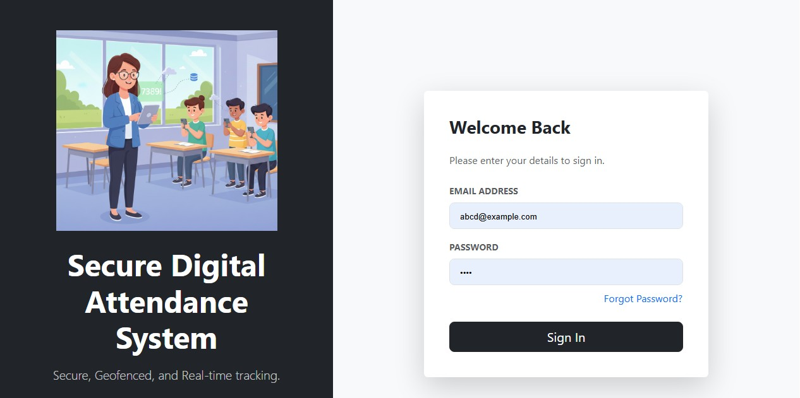
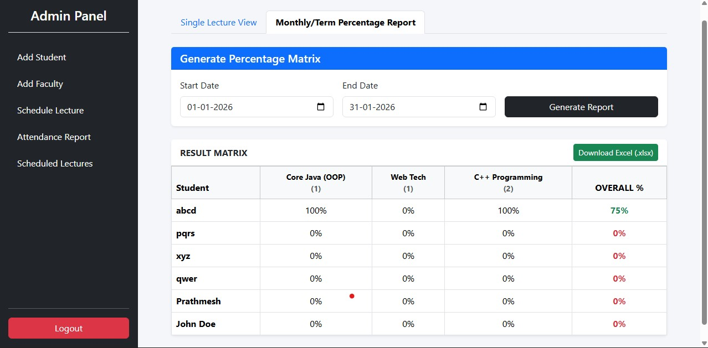

# Secure Digital Attendance System

A comprehensive full-stack web application designed to digitize and secure the attendance process for educational institutions. This system utilizes geofencing technology, time-bound OTPs, and role-based access control to ensure accurate and proxy-proof attendance tracking.

## Project Overview

- **Role-Based Access:** Distinct portals for Admins, Faculty, and Students.
- **Geofencing Security:** Students can only mark attendance when physically present near the Faculty's location.
- **Real-Time OTP:** Dynamic OTP generation with strict time expiration.
- **Reporting:** Automated calculation of attendance percentages and downloadable Excel reports.
- **Secure Authentication:** JWT-based login and Email OTP for password recovery.

## Technology Stack

- **Backend:** Java 21, Spring Boot 3.4.0, Spring Security, JWT, JavaMailSender
- **Frontend:** React.js, Vite, Bootstrap 5
- **Database:** MySQL 8.0
- **Build Tools:** Maven (Backend), NPM (Frontend)

---

## Setup and Installation Guide

Follow these steps to set up the project locally.

### 1. Prerequisites

Ensure you have the following installed on your machine:

- Java Development Kit (JDK 21 or later)
- Node.js and npm
- MySQL Server
- Maven

### 2. Database Setup

1.  Open your MySQL Workbench or Command Line.
2.  Create a database named `attendance_db`.
3.  Ensure your MySQL server is running on port `3306`.

### 3. Backend Setup

1.  Open a terminal and navigate to the backend directory:

    ```bash
    cd backend
    ```

2.  **Configuration:**
    Ensure you have updated `src/main/resources/application.properties` with your local MySQL credentials and Email App Password as required.

3.  **Build and Run:**
    Run the following command to download dependencies and start the server:

    ```bash
    mvn spring-boot:run
    ```

4.  The Backend will start on: `http://localhost:8080`

### 4. Frontend Setup

1.  Open a new terminal window (keep the backend running) and navigate to the frontend directory:

    ```bash
    cd frontend
    ```

2.  **Install Dependencies:**
    Download the required node modules:

    ```bash
    npm install
    ```

3.  **Run the Application:**
    Start the Vite development server:

    ```bash
    npm run dev
    ```

4.  The Frontend will start on: `http://localhost:5173`

---

## Project Walkthrough & Implementation

### 1. Authentication

Secure login page for all users (Admin, Faculty, Student) with Role-Based redirection.



### 2. Admin Module

**User Management:** The Admin can register new Students and Faculty members securely.

<video src="screenshots/Add%20Student%20%26%20Faculty.mp4" controls="controls" style="max-width: 100%;">
  Your browser does not support the video tag.
</video>

**Scheduling:** Admins can schedule lectures for specific courses and subjects.

<video src="screenshots/Schedule%20Lectures.mp4" controls="controls" style="max-width: 100%;">
  Your browser does not support the video tag.
</video>

**Reporting:** Generate detailed attendance matrices and download Excel reports.



### 3. Faculty Module

**Conducting Lectures:** Faculty starts a class, which captures their geolocation and generates a time-bound OTP.

<video src="screenshots/Conduct_Lectures.mp4" controls="controls" style="max-width: 100%;">
  Your browser does not support the video tag.
</video>

### 4. Student Module

**Marking Attendance:** Students enter the OTP. The system validates that they are within the allowed radius of the Faculty's location.

<video src="screenshots/GeoLocation_Based_Attendance_Mark.mp4" controls="controls" style="max-width: 100%;">
  Your browser does not support the video tag.
</video>

---

## API Endpoints Overview

| Module  | Method | Endpoint                           | Description                      |
| :------ | :----- | :--------------------------------- | :------------------------------- |
| Auth    | POST   | `/api/auth/login`                  | User Login                       |
| Auth    | POST   | `/api/auth/forgot-password`        | Send Reset OTP                   |
| Admin   | POST   | `/api/admin/student`               | Register Student                 |
| Admin   | POST   | `/api/admin/faculty`               | Register Faculty                 |
| Faculty | POST   | `/api/faculty/lectures/{id}/start` | Start Class (Geo-tagging)        |
| Student | POST   | `/api/student/mark-attendance`     | Mark Attendance (Geo-validation) |
